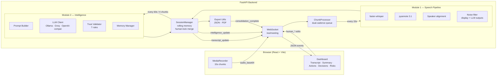

# LiveNote

**Real-time, open-source meeting intelligence that runs on your own machine.**

LiveNote captures live meeting audio from the browser, transcribes it incrementally, and extracts structured intelligence — running summaries, action items, decisions, and risks — using open-source LLMs. All of it streams into a React dashboard where a human can correct anything in real time. It is a zero-cost, self-hostable alternative to Zoom AI Companion and Otter.ai.

---

## Table of Contents

1. [Problem Statement](#problem-statement)
2. [Solution](#solution)
3. [Tech Stack](#tech-stack)
4. [Architecture](#architecture)
5. [Repository Structure](#repository-structure)
6. [Sample UI](#sample-ui)
7. [Running Locally](#running-locally)
8. [Evaluation & Results](#evaluation--results)
9. [Use Cases](#use-cases)
10. [Author & Contributing](#author--contributing)

---

## Problem Statement

Live meeting assistants like **Zoom AI Companion**, **Otter.ai**, and **Fireflies.ai** have become the default way teams capture meeting intelligence — summaries, action items, decisions. But every mainstream option shares the same three constraints:

- **Paywalled.** The useful features sit behind per-seat subscriptions.
- **Cloud-only.** Your audio is uploaded to a third-party vendor. In regulated industries (healthcare, legal, finance, research interviews), this is a non-starter.
- **Proprietary & opaque.** You cannot inspect how summaries are generated, cannot correct the model mid-meeting, and cannot run the pipeline on internal infrastructure.

There is no open, end-to-end, self-hostable system that does real-time meeting intelligence with human-in-the-loop correction.

## Solution

**LiveNote** is an open-source real-time meeting intelligence pipeline. It is designed around three ideas:

1. **Dual-cadence processing.** Transcripts update every **15 seconds** (fast), intelligence (summary + action items + decisions + risks) updates every **60 seconds** (slower but more coherent). This matches how humans actually read a live meeting.
2. **Human-in-the-loop edits.** Any field the user edits becomes `human_locked=true` — the AI is never allowed to overwrite it. This is the most safety-critical invariant in the system.
3. **Trust-validated extraction.** Every LLM output passes through a seven-rule trust validator (owner validity, evidence-timestamp checks, deadline parsing, schema validation, duplicate detection, lock preservation, evidence requirement) before reaching the UI.

The system runs entirely on a laptop. No cloud vendor sees your audio.

## Tech Stack

| Layer | Choice | Why |
|---|---|---|
| **Backend** | Python 3.10+, FastAPI, asyncio, Pydantic v2 | Async WebSockets + clean data contracts |
| **ASR** | faster-whisper (small) | Best WER-to-latency tradeoff on CPU (see Notebooks 05–07) |
| **Diarization** | pyannote 3.1 | Open, accurate speaker attribution (optional via feature flag) |
| **LLM (intelligence)** | Ollama + `mistral:7b` (local) / Groq / any OpenAI-compatible API | Winner of head-to-head eval in Notebook 10; provider-swappable |
| **LLM (evaluation judge)** | Ollama + `llama3.1:8b` | Used only in evaluation notebooks as an independent judge |
| **Audio processing** | pydub, ffmpeg | webm → wav conversion |
| **Frontend** | React 18, TypeScript, Vite, TailwindCSS, lucide-react | Fast dev loop, tiny bundle |
| **Transport** | WebSocket (JSON envelopes + base64 audio) | Single persistent connection for bidirectional streaming |
| **Deploy** | Docker, docker-compose, Vercel (frontend), HuggingFace Spaces (backend) | Free-tier friendly |

## Architecture



### Key architectural decisions (locked)

- **Dual-output noise filter** — `display_utterances` (lightly filtered, for UI) and `llm_utterances` (aggressively filtered, for LLM) are produced from the same chunk.
- **Queue overflow policy** — the *newest* chunk is rejected (not the oldest), so the meeting record never has gaps.
- **Final consolidation pass** — on `meeting_end`, any partial ASR chunk and partial LLM window are flushed, then a consolidation pass deduplicates items and refines the summary. Human-locked fields are never touched.
- **Four deployment modes** via feature flags: `DIARIZATION_ENABLED` × `LIVE_INTELLIGENCE_ENABLED`.

The full architecture specification lives in [`LiveNote_Final_Architecture.md`](./LiveNote_Final_Architecture.md).

## Repository Structure

Only files containing logic or evaluation work are listed.

```
LiveNoteAI/
├── backend/
│   ├── app/
│   │   ├── main.py                      FastAPI app, WebSocket endpoint, HTTP exports
│   │   ├── websocket_manager.py         Per-meeting socket fan-out
│   │   ├── session_manager.py           Meeting state, rolling memory, human-lock merge
│   │   ├── chunk_processor.py           Dual-cadence worker (15s ASR + 60s LLM)
│   │   ├── module1/
│   │   │   ├── asr.py                   faster-whisper wrapper
│   │   │   ├── diarization.py           pyannote 3.1 wrapper
│   │   │   ├── alignment.py             Max-overlap speaker assignment
│   │   │   └── noise_filter.py          Dual display/LLM filtering
│   │   ├── module2/
│   │   │   ├── llm_client.py            Strategy pattern: Ollama / Groq / OpenAI-compat
│   │   │   ├── prompt_builder.py        System + user prompt assembly
│   │   │   ├── trust_validator.py       7 validation rules
│   │   │   ├── memory_manager.py        Rolling state + consolidation
│   │   │   └── intelligence_extractor.py   Module 2 orchestrator
│   │   ├── models/
│   │   │   ├── utterance.py             Utterance, ChunkTranscript
│   │   │   ├── intelligence.py          ActionItem, Decision, Risk, TrustViolation
│   │   │   └── memory.py                MemoryState, ChunkHistoryEntry
│   │   └── utils/
│   │       ├── audio_utils.py           webm → wav conversion
│   │       └── export_utils.py          PDF + JSON export
│   ├── scripts/
│   │   ├── warmup_models.py             Pre-downloads Whisper + pyannote weights
│   │   └── llm_judge_eval.py            LLM-as-judge evaluation driver
│   ├── tests/                           pytest (50+ unit tests)
│   ├── requirements.txt
│   └── .env.example
├── frontend/
│   ├── src/
│   │   ├── App.tsx
│   │   ├── components/
│   │   │   ├── MeetingDashboard.tsx     Top-level orchestration
│   │   │   ├── TranscriptPanel.tsx      Live transcript view
│   │   │   ├── SummaryPanel.tsx         Editable running summary
│   │   │   ├── ActionItemsPanel.tsx     Action item CRUD
│   │   │   ├── DecisionsPanel.tsx       Decision CRUD
│   │   │   ├── RisksPanel.tsx           Risk CRUD
│   │   │   └── ExportPanel.tsx          JSON / PDF download
│   │   ├── hooks/
│   │   │   ├── useMeetingSession.ts     WebSocket lifecycle + state
│   │   │   ├── useMediaRecorder.ts      Browser audio capture
│   │   │   └── useTranscript.ts         Transcript store
│   │   ├── utils/websocket.ts           WS helpers
│   │   └── types/meeting.ts             Wire-protocol types (single source of truth)
│   ├── package.json
│   ├── vite.config.ts
│   └── .env.example
├── Notebooks/
│   ├── DatasetsEDAandInitialModels.ipynb    Dataset exploration (AMI, ICSI)
│   ├── 04_baseline_evaluation.ipynb          Baseline pipeline end-to-end
│   ├── 05_module1_wer_validation.ipynb       ASR WER comparison (base vs small)
│   ├── 06_module1_speaker_validation.ipynb   Diarization accuracy
│   ├── 07_module1_icsi_stress_test.ipynb     ICSI long-meeting stress test
│   ├── 08_module2_rouge_evaluation.ipynb     Summary quality (ROUGE)
│   ├── 09_module2_action_llm_judge.ipynb     LLM-as-judge for action items
│   └── 10_module2_llm_comparison.ipynb       LLaMA 3.1 8B vs Mistral 7B head-to-head
├── CLAUDE.md                                  Project reference + locked architecture rules
├── LiveNote_Final_Architecture.md             Full architecture specification
├── Dockerfile
├── docker-compose.yml
└── README.md
```

## Sample UI

The dashboard is a single page with seven coordinated panels:

| Panel | What it does |
|---|---|
| **Header / Recording controls** | Start / stop meeting, connection status, chunk counter |
| **Transcript** | Live, speaker-attributed transcript; every line is editable |
| **Summary** | Running summary updated every 60s; editing it locks it |
| **Action Items** | Task · Owner · Deadline · Priority · Status — add / edit / delete / restore |
| **Decisions** | Decisions made, with evidence spans into the transcript |
| **Risks** | Risks raised, same evidence-span model |
| **Export** | Download the meeting as JSON or PDF at any time |

During a meeting, you see:

- Transcript lines appearing **~15–18 seconds** after they are spoken.
- Intelligence panels refreshing **~75 seconds** after each new window.
- A lock indicator on any field a human has edited — the AI will never overwrite it.

> Add screenshots to `docs/screenshots/` and reference them here, e.g.:
>
> ``

## Running Locally

### Prerequisites

- **Python 3.10+**
- **Node.js 18+** and **npm**
- **ffmpeg** — on macOS: `brew install ffmpeg`
- **Ollama** (for local LLM inference) — [ollama.com](https://ollama.com)
- A **HuggingFace access token** (free) — required only if you enable diarization, since pyannote models are gated. [Create one here](https://huggingface.co/settings/tokens).

### 1. Clone

```bash
git clone https://github.com/<your-username>/LiveNoteAI.git
cd LiveNoteAI
```

### 2. Backend setup

```bash
cd backend
python3 -m venv venv
source venv/bin/activate        # Windows: venv\Scripts\activate
pip install -r requirements.txt
```

Copy the env template and fill in the values you need:

```bash
cp .env.example .env
```

Minimum `.env` values for a local all-Ollama run:

```
LLM_MODE=ollama
OLLAMA_BASE_URL=http://localhost:11434
OLLAMA_MODEL=mistral:7b

DIARIZATION_ENABLED=false          # set to true + add HF_TOKEN if you want speaker attribution
LIVE_INTELLIGENCE_ENABLED=true

ASR_CHUNK_SEC=15
LLM_WINDOW_CHUNKS=4

ALLOWED_ORIGINS=http://localhost:5173
```

Pull the LLM and pre-warm ASR / diarization weights:

```bash
ollama pull mistral:7b
python scripts/warmup_models.py
```

Run the backend:

```bash
uvicorn app.main:app --reload --port 8000
```

Health check: `http://localhost:8000/health` should return `{"status": "ok", ...}`.

### 3. Frontend setup

In a second terminal:

```bash
cd frontend
npm install
cp .env.example .env
```

Default `.env`:

```
VITE_BACKEND_WS_URL=ws://localhost:8000/ws/meeting
```

Run the dev server:

```bash
npm run dev
```

Open **http://localhost:5173**, click **Start Meeting**, grant microphone permission, and start talking.

### Run with Docker

```bash
docker-compose up --build
```

Starts the backend on port 8000 and the frontend on port 5173.

### Run the tests

```bash
cd backend && python -m pytest tests/ -v
```

## Evaluation & Results

Every model choice in this repo was made by running a head-to-head evaluation notebook against a held-out dataset. Full methodology and raw numbers live in the `Notebooks/` directory — the tables below summarise the shipped decisions.

### ASR — `faster-whisper base` vs `small` (Notebook 05)

250-row AMI sample, filtered to 136 non-trivial utterances.

| Metric | base | **small (winner)** |
|---|---|---|
| Corpus WER | 0.276 | **0.230** |
| Normalized mean utterance WER | 0.522 | **0.404** |
| Filtered corpus WER (≥ 1 word) | 0.239 | **0.202** |

**`small`** produced a ~23 % relative reduction in corpus WER. The gap widened on longer utterances (WER 0.197 on 8–16-word segments vs 0.212 for `base`), which dominate a real meeting.

### Diarization — base vs small backbone (Notebook 06)

Same 250-row AMI sample, pyannote 3.1 + max-overlap alignment.

| Metric | base | **small (winner)** |
|---|---|---|
| Unknown-speaker rate | 22.4 % | **21.2 %** |
| Mean alignment coverage | 0.647 | **0.673** |
| Strong-alignment rate | 54.0 % | **58.4 %** |

### Dual-cadence validation — incremental vs single-pass (Notebook 08)

25 AMI meetings, Mistral 7B extractor.

| Mode | ROUGE-1 | ROUGE-2 | ROUGE-L | Mean latency (s) |
|---|---|---|---|---|
| Single-pass (whole meeting at once) | 0.022 | 0.004 | 0.017 | 65.87 |
| **Incremental (dual-cadence, 60 s window)** | **0.027** | **0.004** | **0.020** | 65.92 |

The incremental pipeline matches single-pass latency but produces higher-quality summaries on every ROUGE metric, validating the 15 s / 60 s dual-cadence design.

### LLM head-to-head — `mistral:7b` vs `llama3.1:8b` (Notebook 10)

20 AMI meetings, local Ollama, identical prompt + trust-validator setup.

| Metric | `llama3.1:8b` | **`mistral:7b` (winner)** |
|---|---|---|
| ROUGE-1 | 0.029 | **0.072** |
| ROUGE-2 | 0.004 | **0.016** |
| ROUGE-L | 0.020 | **0.047** |
| JSON validity rate | 90 % | 90 % |
| Median window latency | **67.4 s** | 88.4 s |
| Trust-violation rate (per meeting) | **3.80** | 8.15 |
| Composite score | 0.333 | **0.500** |

Mistral produced **~2.5× the ROUGE-1** of LLaMA 3.1 8B on the same inputs. It pays for this with more trust-validator violations and slower inference, but those violations are caught by the validator before they reach the UI — so Mistral shipped as the production extractor, and the slower LLaMA 3.1 8B became the independent judge for Notebook 09.

### Action-item quality — LLM-as-judge on Mistral (Notebook 09)

31 action items across 4 AMI meetings, judged by `llama3.1:8b`.

| Dimension | Value |
|---|---|
| Correctness (mean, 1–5) | **3.29** |
| Specificity (mean, 1–5) | 2.68 |
| Grounding (mean, 1–5) | 2.65 |
| Hallucination rate | 48.4 % |

Correctness is good but nearly half of raw extractions contain some hallucination — **which is exactly why the 7-rule trust validator exists**. In production, any item failing the evidence-timestamp or owner-validity rule is marked `needs_review=true` and surfaced with a warning chip in the UI instead of being silently shown.

### What was *not* done (by design)

- **No fine-tuning.** All LLMs are used as-is via Ollama. Intelligence extraction is prompt-engineered with structured JSON output and defended by the trust validator.
- **No cloud dependency during evaluation.** The pipeline runs locally so the results are reproducible on any laptop.

## Use Cases

- **Team standups and planning meetings** — automatic action items with owners and deadlines.
- **1:1s and performance reviews** — private, on-device capture; no vendor sees the audio.
- **Customer discovery and user interviews** — extract decisions and risks from raw conversation.
- **Classroom lectures and lab meetings** — searchable transcript + structured notes for later review.
- **Legal, clinical, and HR conversations** — air-gapped deployment for regulated contexts.
- **Research interviews and qualitative studies** — speaker-attributed transcripts with reviewable evidence spans.

## Author & Contributing

**Satwik Yarapothini** — capstone author and maintainer.

- Email: **satwikyarapothini@gmail.com**
- GitHub: [@satwik77-dev](https://github.com/satwik77-dev)

### Open Source

LiveNote is **open source and contributions are welcome**. If you want to add a new LLM provider, a new export format, a new ASR language, a better noise filter, or anything else — open an issue first to discuss the direction, then send a pull request.

**Ground rule:** the architectural decisions in [`LiveNote_Final_Architecture.md`](./LiveNote_Final_Architecture.md) are locked — things like the dual cadence, the human-lock invariant, the dual-output noise filter, and the seven trust-validator rules should not be changed without discussion, because they are what make the system safe.

To propose a change:

1. Open a GitHub issue describing the motivation.
2. For anything touching architecture or data models, tag it `rfc`.
3. For bug fixes or new providers / exports, just send a PR.

### License

Released under the **MIT License**. Add a `LICENSE` file at the repository root if you have not already — GitHub will help you generate one from its UI.
